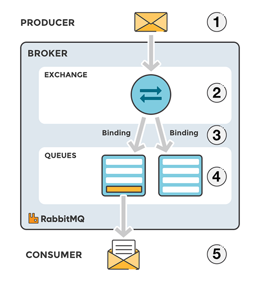

# RabbitMQ

### 정의
- AMQP(Advanced Messaging Queuing Protocol)를 구현
  - 메시징에 사용하는 프로토콜
- 개념/용어
    - Producer: 메시지 송신 프로그램
    - Consumer: 메시지 수신 프로그램
      - Producer와 Consumer는 동일한 서버에 있거나 다른 서버에 있을 수 있음
    - Queue: 메시지가 Consumer에 전송되기 전까지 저장되는 버퍼
    - Exchange: Message가 Queue로 가기 이전에 어떤 Queue로 연결될지 결정. 일종의 라우터
        - Type: Direct, Fanout, Topic, Headers Exchange
    - Binding: Exchage와 Queue간의 규칙
    - Broker(RabbitMQ)



### 설치
- Docker로 RabbitMQ 설치
```bash
docker run -d --name rabbitmq -p 5672:5672 -p 15672:15672 rabbitmq:management
```
- management plugin: http://container-ip:15672
- username/pwd: guest/guest


---
> https://hub.docker.com/_/rabbitmq
> https://www.rabbitmq.com/getstarted.html
> https://www.cloudamqp.com/blog/part1-rabbitmq-for-beginners-what-is-rabbitmq.html
> https://thepracticaldeveloper.com/produce-and-consume-json-messages-with-spring-boot-amqp/
> https://jonnung.dev/rabbitmq/2019/02/06/about-amqp-implementtation-of-rabbitmq/
> https://www.baeldung.com/spring-scheduled-tasks